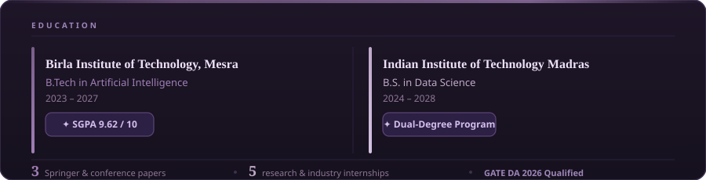
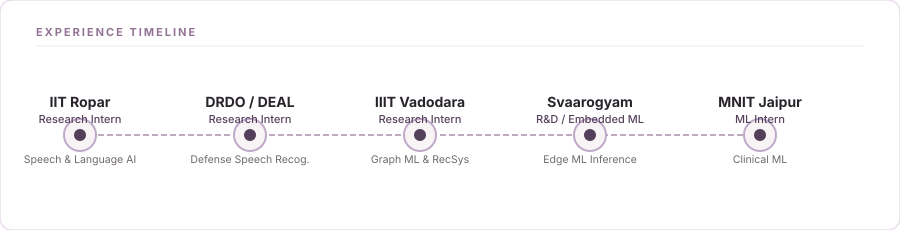
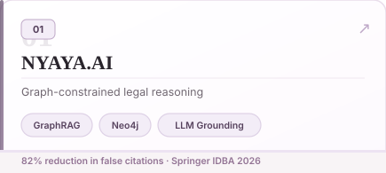
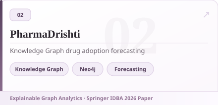
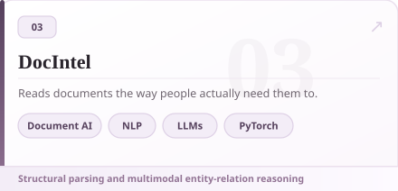
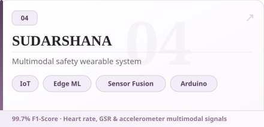
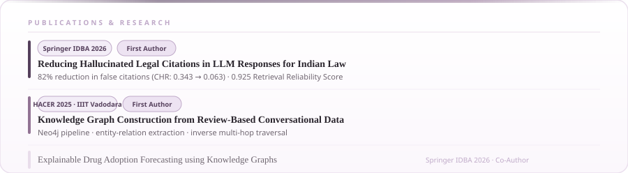
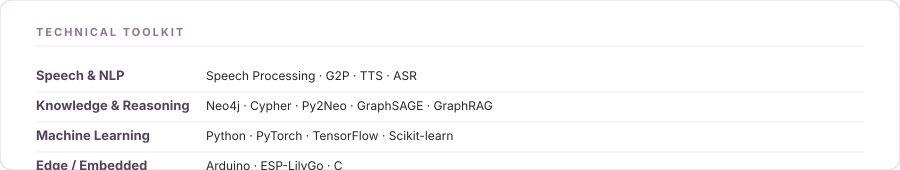
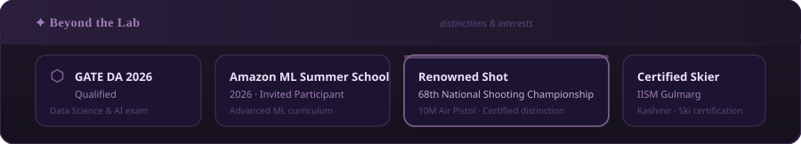

  

 

  <strong>AI and Data Science student researching speech, language, knowledge graphs and trustworthy AI systems.</strong> 
  <em>Building, researching and occasionally overthinking machine learning.</em>

 

  
  &nbsp;
  
  &nbsp;
  
  &nbsp;
  

 
 

 
 

 
 

<table width="100%" border="0" cellspacing="0" cellpadding="0">
  <tr>
    <td width="50%" valign="top">
      
    </td>
    <td width="2%"></td>
    <td width="48%" valign="top">
      
    </td>
  </tr>
  <tr><td colspan="3" height="10"></td></tr>
  <tr>
    <td width="50%" valign="top">
      
    </td>
    <td width="2%"></td>
    <td width="48%" valign="top">
      
    </td>
  </tr>
</table>

 
 

 
 

 
 

 
 

  
  &nbsp;&nbsp;
  

 
 

  ✦ &nbsp; <em>Let's connect and build meaningful things together.</em> &nbsp; ✦

